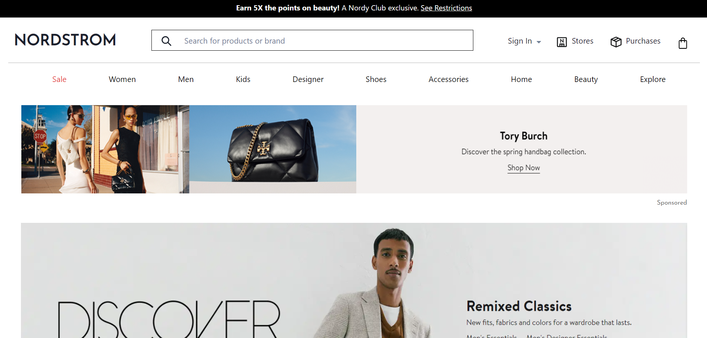
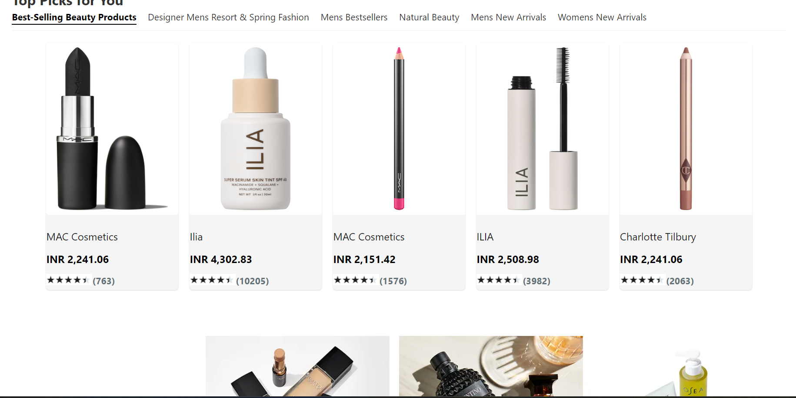
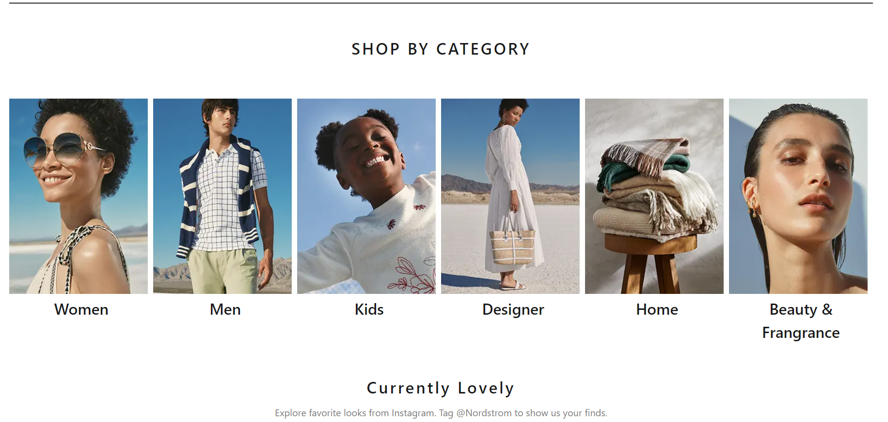
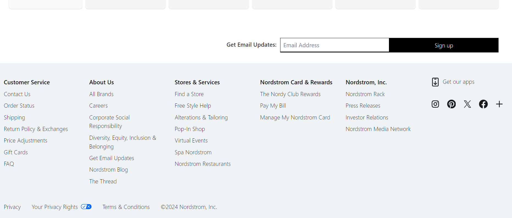

# Nordstrom-Clone

## Introduction:
 
 - Nordstrom is an e-commerce website where you can buy all the things related to kidsware, womenware, Menware , beauty products , home appliences and lot more things
 
 - In this project I have cloned the entire front page of the website from top to bottom 

  ## Tech stacks used :
   
   - `React JS`
   - `javaScript`
   - `Chakra UI`
   - `Choc UI `

## Functionality
   
   - `slider` 

### 🏠 images for reference

---

---

---

---
## Feel free to provide any feedback on this project.🤝✨

---